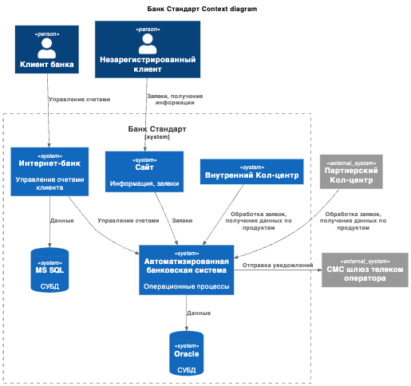
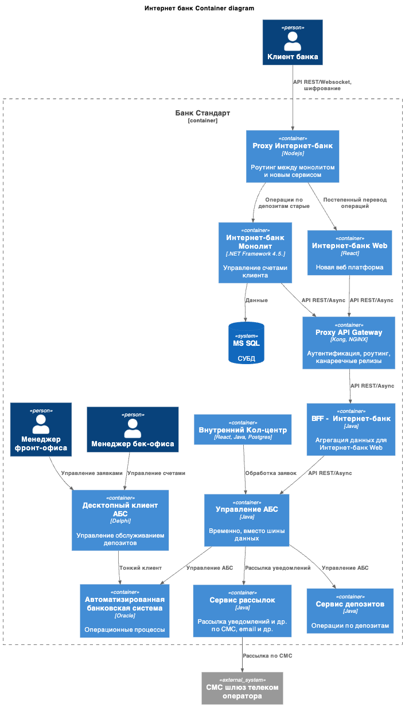

### **Название задачи: ADR открытие депозита**

### **Автор: Овчинников Кирилл**

### **Дата: 22.02.2026**

### **Функциональные требования**

| **№** | **Действующие лица или системы** | **Use Case**    | **Описание**                                                                                                                                                                                                                                                                               |
| :---: | :------------------------------- | :-------------- | :----------------------------------------------------------------------------------------------------------------------------------------------------------------------------------------------------------------------------------------------------------------------------------------- |
|  UC1  | Новый клиент, сайт               | Заявка депозита | 1. Клиент переходит на сайт, открывается список депозитов с ставками  2. Заполянет свой телефон и ФИО и отправляет заявку  3. Менеджер колл-центра видит в своей системе заявку, связывается с клиентом для предложения особых условий и приглашения в отделение для идентификации |
|  UC2  | Клиент, интернет-банк            | Заявка депозита | 1. Клиент при заходе в интернет-банк получает список актуальных депозитов со ставками.  2. Может подать заявку на октрытие депозита  3. При подаче получает подтверждение по СМС                                                                                                   |

### **Нефункциональные требования**

| **№** | **Требование**                                                            |
| :---: | :------------------------------------------------------------------------ | --- |
|   R   | Надёжность (Reliability)                                                  |     |
|  R1   | Все данные, передаваемые с сайта, интернет-банка необходимо шифровать     |     |
|  R2   | Сайт и интернет-банк должны работать 24/7 и быть доступны в 99,9% случаев |     |
|   P   | Производительность (Performance)                                          |     |
|  P1   | Отклик по всем операциям должен быть миллисекунды                         |     |
|  +R   | + Ограничения (Restrictions)                                              |     |
|  +R1  | Вести документацию систем для всех изменений                              |     |

### **Решение**

- диаграмма контекста
  - 

- диаграмма контейнеров
  - 

Интернет банк

- оставляем текущий UI. Необходима постепенная миграция клиентов на новый интерфейс, чтобы не оттолкнуть пожилых клиентов, которые привыкли к старому интерфейсу
- создаем новый UI для добавления новых задач
  - под него свой BFF, чтобы в будущем по такому пути можно сделать мобильное приложение
- в старом монолите делаем ссылки на новые функции, которые переключат клиента на новую платформу
  - прокси для BFF для каждой платформы

АБС

- сервис Управление (самописная шина данных, Kafka пока не доступна для платформы)
- выносим операции по депозитам в отдельный сервис, общается с АБС через сервис Управления

### **Альтернативы**

- Используем паттерн "большой взрыв" и сразу переписываем Интернет банк на новую платформу
  - риск оттока клиентов, которые не привыкли к новому интерфейсу
  - критические ошибки могут повлиять на все операции, а не только на новые функции
- доработать монолит под новые задачи и оставить доступ от него до АБС как было

**Недостатки, ограничения, риски**

- целых 2 прокси между монолитом и новой платформой
- самописная шина данных - ресурсоемкое решение с потенциальными проблемами с надежностью
  - все таки Kafka уже законченное решение
- колл-центр, менеджеры бек/фронт офисов общаются напрямую с АБС
