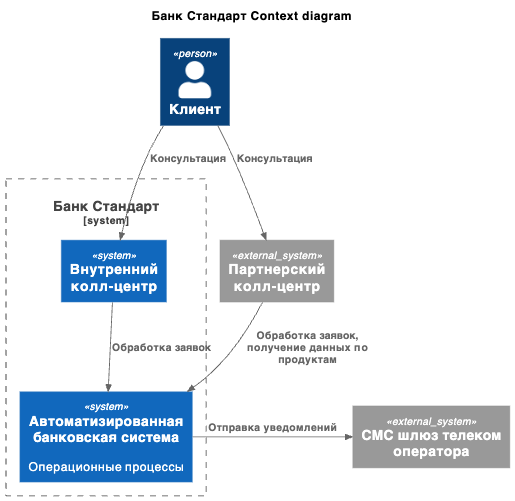
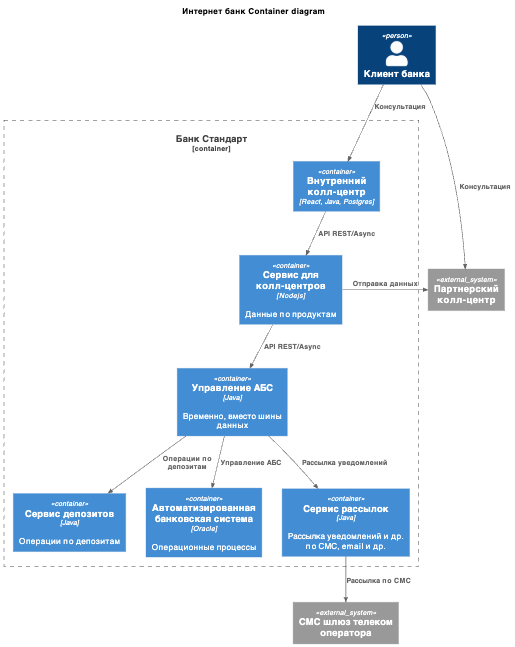

### **Название задачи: ADR передача ставок в call center**

### **Автор: Овчинников Кирилл**

### **Дата: 22.02.2026**

### **Функциональные требования**

| **№** | **Действующие лица или системы** | **Use Case**    | **Описание**                                                                                                                                                                                                                                                                   |
| :---: | :------------------------------- | :-------------- | :----------------------------------------------------------------------------------------------------------------------------------------------------------------------------------------------------------------------------------------------------------------------------- |
|  UC1  | Внутренний колл-центр, АБС       | Передача ставки | 1. колл-центр предоставляет консультацию по депозитам  2. Обращается к системе АБС, получает текущие ставки по депозитам                                                                                                                                                   |
|  UC2  | Внешний колл-центр, АБС          | Передача ставки | 1. колл-центр предоставляет консультацию по депозитам  2. Внешний колл-центр не может напрямую получить данные по ставкам по депозитам  3. Внутрення система банка высылает по расписанию 4 раза в день актуальные ставки в виде файлов во внешнюю систему колл-центра |

### **Нефункциональные требования**

| **№** | **Требование**                                                                                                                               |
| :---: | :------------------------------------------------------------------------------------------------------------------------------------------- |
|   R   | Надёжность (Reliability)                                                                                                                     |
|  R1   | Запросы на из внутренней системы колл-центра должны быть работать 24/7 и быть доступны в 99,9% случаев и отклик на получение менее 1 секунды |
|  R1   | Отправка файлов во внешнюю систему не должна никак влиять на работу основных сервисов ни при сбое ни при нагрузке                            |
|   P   | Производительность (Performance)                                                                                                             |
|  P1   | Отклик по всем операциям должен быть миллисекунды                                                                                            |
|  +R   | + Ограничения (Restrictions)                                                                                                                 |
|  +R1  | Отдельный сервис в системе АБС для нужд колл-центров (внутреннего и внешнего)                                                                |

### **Решение**

- диаграмма контекста
  - 

- диаграмма контейнеров
  - 

- отдельный сервис для работы с данными длч колл-центров
  - ограничение доступа, контроль данных
- колл-центры не имеют прямого доступа к АБС

### **Альтернативы**

- доработать внутренний колл-центр для "транзита" данных через него во внешние колл-центры
- напрямую из АБС отправлять одинаково и внутреннему и внешнему колл-центрам

**Недостатки, ограничения, риски**

- нет гарантии доставки файлов со ставками во внешнюю систему
- репутационные риски
  - неактуальные данные при отправке 4 раза в день
